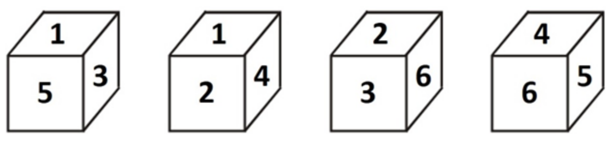

# Day 7
* * *
##  Course -- `Fourier Transform`

 

* **Q: 多项式乘法**
  > 给出多项式$A(x) = a_nx^n 和B(x) = b_nx^n$，求$A(x) ⋅ B(x)$

 

* **系数表示法和点值表示法**
  > 对于N − 1次多项式f(x)，可以有2种不同的表示方法：
  > * 系数表示法 ：
  > $$\sum_{0{\leq}n<N}c_nx^n$$
  > * 点值表示法 ：
  > $(x_1, x_2, ..., x_n)$，$(y_1, y_2, ..., y_n)$满足$f(x_i) = y_i$，即$(x_i, y_i)$是曲线$y = f(x)$上的点
  > 显然，系数表示法和点值表示法可以相互转。
  >  
  > 系数表示法$\rightarrow$点值表示法:
  > $$y_i = \sum_{0{\leq}n<N}c_ix^n$$
  > 点值表示法$\rightarrow$系数表示法:
  > $$f(x) = \sum_{0{\leq}n<N}y_i\frac{\prod_{j{\neq}i}(x_i -x_j)}{\prod_{j{\neq}i}(x - x_j)}$$

 

* **A: 多项式乘法**
  > 对于多项式$A(x)$和$B(x)$，假设$degA + degB < N$。如果有$A$和$B$在${x_1, x_2, ..., x_n}$处的点值表示，则$(A ⋅ B)$的点值表示可以通过
  > $$(A⋅ B)(x_i) = A(x_i) ⋅ B(x_i)$$
  > 在$O(N)$时间内得到。还原$(A ⋅ B)$为系数表示就实现了多项式乘法。变换复杂度为$O(N^2)$。

 

* **离散傅里叶变换(DFT)**
  > 考虑在$1, ω, ω^2, ..., ω^{N-1}$的点值表示($ω$为$N$次单位复根)，即
  > $$y_k = \sum_{i = 0}^{N - 1}c_i(^k)^i$$
  > 假设$N = 2^k$，$(y_0, y_1, ..., y_{N - 1} )$可以快速求出。

 

* **快速傅里叶变换(FFT)**
  > $$f(x) = \sum_{i = 0}^{N / 2-1}a_{2i}(x ^ 2)^i + x \ sum_{i = 0}^{N / 2 - 1}a_{2i + 1}(x ^ 2)^i$$
  > 当$x$取遍所有$N$次单位复根时，$x^2$取遍所有$N/2$次单位复根。所以只需要计算多项式
  > $$f_0(x) = \sum_{i = 0}^{N / 2 - 1}a_{2i}(x ^ 2)^i$$
  > 和
  > $$f_1(x) = \sum_{i = 0}^{N / 2 - 1}a_{2i + 1}(x ^ 2)^i$$
  > 的DFT。

 

* **逆离散傅里叶变换(IDFT)**
  > $$y_k = \sum_{i=0}^{N-1}c_i(ω^k)^i$$
  > $$\frac{1}{N}\sum_{i=0}^{N-1}y_i(ω^{-k})^i = \frac{1}{N}\sum_{i=0}^{N-1}(\sum_{i=0}^{N-1}c_j(ω^i)^j)(ω^{-k})^i$$
  > $$= \frac{1}{N}\sum_{i=0}^{N-1}c_j(\sum_{i=0}^{N-1}(ω^{j-k})^i) = c_k$$
  > 当$k{\neq}0$时，
  > $$1 + ω^k + (ω^k)^2 + ... + (ω^k)^{N-1} = \frac{1-(ω^k)^N}{1 - ω^k} = 0$$

 

* **卷积下的FFT**
  > * 卷积：给定有限长度的序列$a_i$, $b_i$，求序列c使得$c_i = \sum_{k = 0}^ia_kb_{i-k}$，显然$c$的长度为$a$, $b$的长度之和减一。
  > * $c_r = \sum_{p,q}[(p + q)mod~n = r]a_pb_q$
  > * $\frac1n\sum{k = 0}{n - 1}ω^{vk} = [v~mod~n = 0]$
  > * $[(p+q)~mod~n = r] = [(p + q - r)~mod~n = 0] = \frac1n\sum_{k = 0}^{n - 1}ω^{(p + q - r)k} = \frac1n\sum$_{k = 0}^{n-1}ω^{-rk}ω^{pk}ω^{qk}
  > * 所以有$c_r = \sum_{p,q}[(p+q)~mod~n = r]a_pb_q = \frac1n\sum_{k = 0}^{n - 1}ω^{-rk}\sum_pω^{pk}a_p\sum_qω^{qk}b_q$
  > * 使用前面的FFT求解后两个求和式，在求解第一个求和式即可。

 

* **蝴蝶操作与位逆序置换**
  > 对奇偶项分开递归处理的操作称为蝴蝶操作。
  > 考虑每个函数的系数：
  > $$(a_0, a_1, a_2, a_3, a_4, a_5, a_6, a_7)$$
  > $$(a_0, a_2, a_4, a_6)(a_1, a_3, a_5, a_7)$$
  > $$(a_0, a_4)(a_2, a_6)(a1, a_5)(a_3, a_7)$$
  > $$(a_0)(a_4)(a_2)(a_6)(a_1)(a_5)(a_3)(a_7)$$
  > 观察$(0, 4, 2, 6, 1, 5, 3, 7)$的二进制表示为$(000, 100, 010, 110,001, 101, 011, 111)$，恰好是把$(000, 001, 010, 011, 100, 101,110, 111)$每一位二进制反转，称为位逆序置换。这样可以实现非递归的FFT，常数更小。

 

* **快速数论变换(NTT)**
  > ${1, ω, ω^2, ω^3, ...}$是2^k阶的循环群。
  > 对于质数$P = 2^k*Q+1$的原根g，$\lbrace 1, g, g^2, g^3, ... \rbrace$是$2^K*Q$阶的循环群。
  > 即$\lbrace 1, g^Q, g^{2Q}, g^{3Q}, ... \rbrace$是$2^K$阶循环群。用$g$替代$ω$即可。
  > 快速数论变换仅适用于数论函数，即所有参数均为自然数的情况。但快速数论变换比快速傅里叶变换常数更小。

 

* **Q: Triple Sums**
  > $N$个整数$A_1, A_2, ... , A_N$，对于所有的$S$，求满足
  > * $A_i + A_j + A_k = S$
  > * $i < j < k$
  > * 的$(i, j , k)$数量。
  > * $(N {\le} 40000, A_i {\le} 20000)$
  > [(SPOJ TSUM)](https://www.spoj.com/problems/TSUM/)

 

* **A: Triple Sums**
  > 考虑$(i, j, k)$可以相等的情况，构造多项式
  > $$A(x) = \sum_{1 {\le} i{\le}N}x^{A_i}$$
  > 则$A^3(x)$中$x^S$项的系数就是所求结果。
  > 考虑使用容斥原理消去相等的影响
  > $$({\sum}x)^3 = {\sum}x^3 + 3{\sum}x^2y + 6{\sum}xyz$$
  > $$({\sum}x^2)({\sum}x) = {\sum}x^3 + {\sum}x^2y$$
  > 即
  > $${\sum}xyz = \frac{({\sum}x^3) - 3({\sum}x^2)({\sum}x) + 2({\sum}x^3)}{6}$$
  > NTT运算即可

 

* **Q: Pattern matching**
  > 长度为$m$的模式串$A$和长度为$n$文本串$B$包含小写字母和通配符$'*'$,$'*'$可以匹配任意一个字符。
  > 求$A$在$B$中所有的出现位置。
  > [(BZOJ4259)](https://www.lydsy.com/JudgeOnline/problem.php?id=4259)

 

* **A: Pattern matching**
  > 对于两个长度相等的字符串$A$和$B$,定义距离函数：
  > $$dis(A, B) = \sum_{i = 0}^{N-1}(A[i]-B[i])^2$$
  > 若$dis(A, B) = 0$，则$A$和$B$完全匹配。
  > 考虑通配符，设通配符值为0，可将距离函数修改为：
  > $$dis(A, B) = \sum_{i = 0}^{N-1}(A[i]-B[i])^2*A[i]*B[i]$$
  > 若$dis(A, B) == 0$，则$A$和$B$完全匹配。
  > 考虑文本串的末尾位置$i$，设$f[i] = dis(A, B[i − m + 1,i])$。
  > 则若以$i$结尾的子串和$A$匹配，有：
  > $$f[i] = \sum_{j = 0}^{N-1}(A[j] - B[i-m+1+j]^2)A[j]B[i-m+1+j]=0$$
  > 将$A$串翻转，并在后面不断补0直至和$B$串等长，那么有：
  > $$f[i] = \sum_{j = 0}^{i}(A[j]-B[i-j])^2A[i]B[i-j]$$
  > $$= \sum_{j = 0}^{i}(A[j]-2A[j]B[i-j]+B[i-j]^2)A[j]B[i-j]$$
  > $$= \sum_{j=0}^{i}A[j]^3B[i-j]-2\sum_{j=0}^{i}A[j]^2B[i-j]^2+\sum_{j=0}^{i}A[j]B[i-j]^3$$
  > 显然可以分三段做FFT求出所有的$f[i]$，时间复杂度为$O(nlogn)$。
  >  
  > **存在一种更简单的构造方法。**
  > 令
  > $$dist(A, B) = \sum_{i=0}^{N-1}A[i]*inv(B[i])$$
  > 若$dist(A,B){\le}N$，则匹配，否则不匹配。只需要做一次FFT或NTT即可。
* * *
## Problem--`SUSTechCPC Winter Camp final`

 

[
 A. A Very Hard Question 
](https://codeforces.com/gym/101502/problem/A)
---

 time limit per test: 1.0 s 

 memory limit per test: 256 MB 

 

Husam was preparing himself for the Graduate Record Examinations (GRE). Yesterday, he read a very hard question, but he could not find a solution for it, so he did not sleep all the night.

Husam decided to tell you about the question, so you can help him to find the solution. The question is: If the price of the orange was increased by x%. How many oranges can be bought for the amount that used to buy y oranges?

Can you help Husam to solve this question?

**Input**

The first line contains an integer T $(1  ≤  T  ≤  10^4)$, where T is the number of test cases.

Then T lines follow, each line contains two integers y and x $(1  ≤  y  ≤  10^6)$ (0  ≤  x  ≤  100), where y is the number of oranges, and x is the percentage increase in price.

**Output**

For each test case, print a single line containing the number of oranges that can be bought for the same amount of money that used to buy y oranges before the price increased.

It is guaranteed that all answers are integer numbers. Do not print any floating-point values.

**Example**

> **Input**
> 3
> 10 25
> 300 20
> 550 100

> **Output**
> 8
> 250
> 275

 

**思路：**
> 签到题。题意是买y个橘子的钱在涨价x%之后能买多少个橘子。注意只能买整数个橘子和输入时先输入的是y，后输入的是x就好。

[[C++实现代码传送门]](https://github.com/SUSTech-Neko/SUSTech-CPC/blob/master/2018Winter/day7/A.cpp)

 

[
 B. Linear Algebra Test 
](https://codeforces.com/gym/101502/problem/A)
---

 time limit per test: 3.0 s 

 memory limit per test: 256 MB 

 

Dr. Wail is preparing for today's test in linear algebra course. The test's subject is Matrices Multiplication.

Dr. Wail has n matrices, such that the size of the $i^{th}$ matrix is $(a_i × b_i)$, where $a_i$ is the number of rows in the $i^{th}$ matrix, and $b_i$ is the number of columns in the $i^{th}$ matrix.

Dr. Wail wants to count how many pairs of indices $i$ and $j$ exist, such that he can multiply the $i^{th}$ matrix with the $j^{th}$ matrix.

Dr. Wail can multiply the $i^{th}$ matrix with the $j^{th}$ matrix, if the number of columns in the $i^{th}$ matrix is equal to the number of rows in the $j^{th}$ matrix.

**Input**

The first line contains an integer T (1 ≤ T ≤ 100), where T is the number of test cases.

The first line of each test case contains an integer n $(1 ≤ n ≤ 10^5)$, where n is the number of matrices Dr. Wail has.

Then n lines follow, each line contains two integers ai and bi $(1 ≤ a_i, b_i ≤ 10^9)$ $(a_i ≠ b_i)$, where $a_i$ is the number of rows in the $i^{th}$ matrix, and $b_i$ is the number of columns in the $i^{th}$ matrix.

**Output**

For each test case, print a single line containing how many pairs of indices i and j exist, such that Dr. Wail can multiply the $i^{th}$ matrix with the $j^{th}$ matrix.

**Example**

> **Input**
> 1
> 5
> 2 3
> 2 3
> 4 2
> 3 5
> 9 4

> **Output**
> 5

 

**思路：**
> 题意是找能够做乘法的矩阵对数。能够做乘法的矩阵一定是一个矩阵的行数等于另一个矩阵的列数（题目已限制一个矩阵的行列长度不等）。观察了矩阵个数n是1e5的数量级，如果我们读完数据一个个比较，时间复杂度是$O(n^2)$，一定会T；如果是开一个1e9的数组去存每个数字出现次数，那么一定会mle。所以想到一个数据结构`map`，它可以自动给读入的数据排序，我们知道快排的平均时间复杂度为$O(nlogn)$，正好匹配我们的n。

[[C++实现代码传送门]](https://github.com/SUSTech-Neko/SUSTech-CPC/blob/master/2018Winter/day7/B.cpp)

 

[
 D. Dice Game 
](https://codeforces.com/gym/101502/problem/D)
---

 time limit per test: 1.0 s 

 memory limit per test: 256 MB 

 

A dice is a small cube, with each side having a different number of spots on it, ranging from 1 to 6.

Each side in the dice has 4 adjacent sides that can be reached by rotating the dice (i.e. the current side) 90 degrees. The following picture can help you to conclude the adjacent sides for each side in the dice.

In this problem, you are given a dice with the side containing 1 spot facing upwards, and a sum n, your task is to find the minimum number of required moves to reach the given sum.

On each move, you can rotate the dice 90 degrees to get one of the adjacent sides to the side that currently facing upwards, and add the value of the **new side** to your current sum. According to the previous picture, if the side that currently facing upwards contains 1 spot, then in one move you can move to one of sides that contain 2, 3, 4, or 5 spots.

Initially, your current sum is 0. Even though at the beginning the side that containing 1 spot is facing upwards, but its value will not be added to your sum from the beginning, which means that you must make at least one move to start adding values to your current sum.

**Input**

The first line contains an integer $T~(1 ≤ T ≤ 200)$, where T is the number of test cases.

Then T lines follow, each line contains an integer $n~(1 ≤ n ≤ 10^4)$, where n is the required sum you need to reach.

**Output**

For each test case, print a single line containing the minimum number of required moves to reach the given sum. If there is no answer, print -1.

**Example**

> **Input**
> 2
> 5
> 10

> **Output**
> 1
> 2

 

**思路：**
> 题意是给定一个骰子，初始状态是1朝上，每次可以传动90°，使得相邻的一个面朝上并加上这个面的点数，求问一个数字要转多少次骰子才能使和是它。如果要次数尽可能少，选择5-6两个面的点数一定是最快的，所以我们只要对一个数mod 11，处理余数即可。但这里需要分情况讨论，一种是原本的数小于11，一种是原本的数大于11，我们分别对0-10，和mod 10之后的0-10分情况讨论，手动计算各种情况的最少步数，最后加上$2*(int)(num / 11)$即可。

[[C++实现代码传送门]](https://github.com/SUSTech-Neko/SUSTech-CPC/blob/master/2018Winter/day7/D.cpp)

 

[
 E. The Architect Omar 
](https://codeforces.com/gym/101502/problem/E)
---

 time limit per test: 1.0 s 

 memory limit per test: 256 MB 

 

Architect Omar is responsible for furnishing the new apartments after completion of its construction. Omar has a set of living room furniture, a set of kitchen furniture, and a set of bedroom furniture, from different manufacturers.

In order to furnish an apartment, Omar needs a living room furniture, a kitchen furniture, and two bedroom furniture, regardless the manufacturer company.

You are given a list of furniture Omar owns, your task is to find the maximum number of apartments that can be furnished by Omar.

**Input**

The first line contains an integer T (1 ≤ T ≤ 100), where T is the number of test cases.

The first line of each test case contains an integer n (1 ≤ n ≤ 1000), where n is the number of available furniture from all types. Then n lines follow, each line contains a string s representing the name of a furniture.

Each string s begins with the furniture's type, then followed by the manufacturer's name. The furniture's type can be:

bed, which means that the furniture's type is bedroom.
kitchen, which means that the furniture's type is kitchen.
living, which means that the furniture's type is living room.
All strings are non-empty consisting of lowercase and uppercase English letters, and digits. The length of each of these strings does not exceed 50 characters.

**Output**

For each test case, print a single integer that represents the maximum number of apartments that can be furnished by Omar

**Example**

> **Input**
> 1
> 6
> bedXs
> kitchenSS1
> kitchen2
> bedXs
> living12
> livingh

> **Output**
> 1

 

**思路：**
> 签到题。题意是装修一套房子，需要一套起居室家具，一套厨房家具，两套卧室家具。给我们很多家具，来自不同的生产厂家，问我们最多能够装修多少套房子？(不管生产厂家)。所以匹配一下字符串首字母，统计数量，根据（一套起居室家具，一套厨房家具，两套卧室家具）的比例，取最小的即可。

[[C++实现代码传送门]](https://github.com/SUSTech-Neko/SUSTech-CPC/blob/master/2018Winter/day7/E.cpp)

 

[
 F. Building Numbers 
](https://codeforces.com/gym/101502/problem/F)
---

 time limit per test: 3.0 s 

 memory limit per test: 256 MB 

 

In this problem, you can build a new number starting from 1, by performing the following operations as much as you need:

* Add 1 to the current number.
* Add the current number to itself (i.e. multiply it by 2).

For example, you can build number 8 starting from 1 with three operations(1->2->4->8). Also, you can build number 10 starting from 1 with five operations(1->2->4->8->9->10).

You are given an array a consisting of n integers, and q queries. Each query consisting of two integers l and r, such that the answer of each query is the total number of operations you need to preform to build all the numbers in the range from l to r (inclusive) from array a, such that each number ai (l ≤ i ≤ r) will be built with the minimum number of operations.

**Input**

The first line contains an integer $T (1 ≤ T ≤ 50)$, where T is the number of test cases.

The first line of each test case contains two integers n and q $(1 ≤ n, q ≤ 10^5)$, where n is the size of the given array, and q is the number of queries.

The second line of each test case contains n integers $a1, a2, ..., an (1 ≤ ai ≤ 10^{18})$, giving the array a.

Then q lines follow, each line contains two integers l and r $(1 ≤ l ≤ r ≤ n)$, giving the queries.

**Output**

For each query, print a single line containing its answer.

**Example**

> **Input**
> 1
> 5 3
> 4 7 11 8 10
> 4 5
> 1 5
> 3 3

> **Output**
> 7
> 18
> 5

 

**思路：**
> 题意是每个数字可以从1进行两种操作（加1或者乘2）来变成。现在有一列数字，给出某一段区间数字需要变化的次数总和。对于单个数字，如果它是偶数，那就除2；如果是奇数，那就减1。如此操作我们可以得到一个数字最小的操作数。然后对一列数字统计操作数的前缀和，计算某一段区间时，用区间尾减去区间头前的一位的前缀和即可。

[[C++实现代码传送门]](https://github.com/SUSTech-Neko/SUSTech-CPC/blob/master/2018Winter/day7/F.cpp)

 

[
 H. Eyad and Math 
](https://codeforces.com/gym/101502/problem/H)
---

 time limit per test: 2.0 s 

 memory limit per test: 256 MB 

 

Eyad was given a simple math problem, but since he is very bad at math he asked you to help him.

Given 4 numbers, a, b, c, and d. Your task is to find whether $a^b$ is less than $c^d$ or not.

**It is guaranteed that the two numbers above are never equal for the given input.**

**Input**

The first line contains an integer $T (1 ≤ T ≤ 10^5)$, where T is the number of test cases.

Then T lines follow, each line contains four integers $a, b, c, and d (1 ≤ a, b, c, d ≤ 10^9)$.

**Output**

For each test case, print a single line containing "<" (without quotes), if $a^b$ is less than $c^d$. Otherwise, print ">" (without quotes).

**Example**

> **Input**
> 2
> 9 2 5 3
> 3 4 4 3

> **Output**
> <
> \>

 

**思路：**
> 题意就是比较大小，但如果是按照暴力求法，一定会T，没有实践过快速幂可不可以，因为这题有很便捷的方法：对$a^b$，$c^d$取对数，就转化成$b*Ina和d*Inc$比较大小就不会T了。

[[C++实现代码传送门]](https://github.com/SUSTech-Neko/SUSTech-CPC/blob/master/2018Winter/day7/H.cpp)

 

[
 I. Move Between Numbers 
](https://codeforces.com/gym/101502/problem/I)
---

 time limit per test: 2.0 s 

 memory limit per test: 256 MB 

 

You are given n magical numbers $a_1, a_2, ..., a_n$, such that the length of each of these numbers is 20 digits.

You can move from the $i^{th}$ number to the $j^{th}$ number, if the number of common digits between $a_i$ and $a_j$ is exactly 17 digits.

The number of common digits between two numbers x and y is computed is follow:

$$Common(x,y)=\sum_{i=0}^9min(CountX_i,CountY_i)$$

Where $countX_i$ is the frequency of the $i^{th}$ digit in the number x, and $countY_i$ is the frequency of the $i^{th}$ digit in the number y.

You are given two integers s and e, your task is to find the minimum numbers of moves you need to do, in order to finish at number $a_e$ starting from number $a_s$.

**Input**

The first line contains an integer $T (1 ≤ T ≤ 250)$, where T is the number of test cases.

The first line of each test case contains three integers $n, s, and e (1 ≤ n ≤ 250) (1 ≤ s, e ≤ n)$, where n is the number of magical numbers, s is the index of the number to start from it, and e is the index of the number to finish at it.

Then n lines follow, giving the magical numbers. All numbers consisting of digits, and with length of 20 digits. Leading zeros are allowed.

**Output**

For each test case, print a single line containing the minimum numbers of moves you need to do, in order to finish at number $a_e$ starting from number $a_s$. If there is no answer, print -1.

**Example**

> **Input**
> 1
> 5 1 5
> 11111191111191111911
> 11181111111111818111
> 11811171817171181111
> 11111116161111611181
> 11751717818314111118

> **Output**
> 3

 

**思路：**
> 题意是如果两个20位的数字串中0-9每个数字共有的数量和正好为17个，那么这两数字串就可以相互跳转，求在给定的若干个数字串中，其中俩数字串的一个变换成另一个最少需要多少步。做法技术根据题目的条件判断任两个数字串能不能转换，从而形成一张图，用Dijkstra算法跑一遍，每个边边长都为1（注意建双向边！）。

[[C++实现代码传送门]](https://github.com/SUSTech-Neko/SUSTech-CPC/blob/master/2018Winter/day7/I.cpp)

 

[
 J. Boxes Game 
](https://codeforces.com/gym/101502/problem/J)
---

 time limit per test: 3.0 s 

 memory limit per test: 256 MB 

 

Ibraheem and Husam are playing a game with group of boxes, lined next to each other on a straight line, such that each box contains a card with some value written on it. Ibraheem and Husam already know the values of all cards before the game starts.

Ibraheem and Husam take turns to play the game, Ibraheem starts first. In each turn, a player can take one box from either ends of the line, add the value of the card inside this box to his score, then remove this box from the line.

Knowing that both players play optimally, your task is to calculate the value x - y, such that x is Ibraheem's score at the end of the game, and y is Husam's score at the end of the game.

**Input**

The first line contains an integer $T (1 ≤ T ≤ 500)$, where T is the number of test cases.

The first line of each test case contains an integer $n (1 ≤ n ≤ 10^3)$, where n is the number of boxes in the line.

The second line of each test case contains n integers $a_1, a_2, ..., a_n ( - 10^3 ≤ ai ≤ 10^3)$, giving the values of the cards inside the boxes.

**Output**

For each test case, print a single line containing its answer.

**Example**

> **Input**
> 5
> 4
> 3 1 100 5
> 1
> 1000
> 4
> -1 100 4 -5
> 1
> -4
> 1
> 0

> **Output**
> 97
> 1000
> 92
> -4
> 0

 

**思路：**
> 经典dp题。二维动态规划，考虑一列数字的左右两端，$dp[i][j]=max\{dp[i+1][j],dp[i][j-1]\}$，递归下去算出最大值，再用两倍最大值减去数字总和求出最大差。

[[C++实现代码传送门]](https://github.com/SUSTech-Neko/SUSTech-CPC/blob/master/2018Winter/day7/J.cpp)

 

[
 K. Malek and Summer Semester 
](https://codeforces.com/gym/101502/problem/K)
---

 time limit per test: 1.0 s 

 memory limit per test: 256 MB 

 

Malek registered n courses for the summer semester. Malek has a success rate m, which means he has to succeed at least in ceil(n × m) courses out of the n courses, in order to consider the summer semester as a successful semester. Malek is considered successful in the $i^{th}$ course, if his grade on this course was greater than or equal to 50.

ceil(x) is the smallest integer greater than or equal to x. For example, ceil(0.95) = 1, ceil(4) = 4, and ceil(7.001) = 8.

Malek will give you his grades in the n courses, and your task is to tell him whether the summer semester was a successful semester or not.

**Input**

The first line contains an integer $T (1 ≤ T ≤ 100)$, where T is the number of test cases.

The first line of each test case contains an integer n and a real number m $(1 ≤ n ≤ 100) (0 < m < 1)$, where n is the number of courses, and m is the required success rate.

The second line contains n integers $a_1, a_2, ..., a_n (0 ≤ a_i ≤ 100)$, where ai is the grade of the ith course.

The success rate m is given with exactly two digits after the decimal point.

**Output**

For each test case, print a single line containing "YES" (without quotes), if the summer semester was a successful semester for Malek. Otherwise, print "NO" (without quotes).

**Example**

> **Input**
> 2
> 5 0.60
> 45 46 48 48 50
> 5 0.75
> 100 99 98 97 100

> **Output**
> NO
> YES

 

**思路：**
> 签到题，判断不小于50分的人有没有到百分比，注意YES和NO的大小写和浮点数。

[[C++实现代码传送门]](https://github.com/SUSTech-Neko/SUSTech-CPC/blob/master/2018Winter/day7/K.cpp)

 
