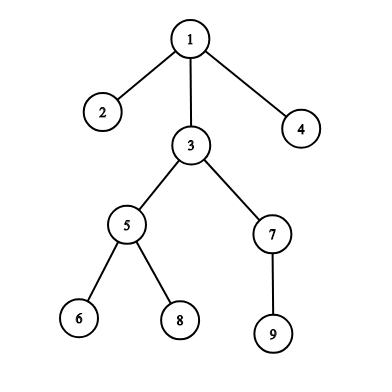

# Day 1
* * *
## Problem--`SUSTechCPC 寒假集训day1`

<br/>

[<center> A - Royal Questions </center>](https://codeforces.com/problemset/problem/875/F)
---

<center> time limit per test: 1.5 s </center>
<center> memory limit per test: 512 MB </center>

<br/>

In a medieval kingdom, the economic crisis is raging. Milk drops fall, Economic indicators are deteriorating every day, money from the treasury disappear. To remedy the situation, King Charles Sunnyface decided make his n sons-princes marry the brides with as big dowry as possible.

In search of candidates, the king asked neighboring kingdoms, and after a while several delegations arrived with m unmarried princesses. Receiving guests, Karl learned that the dowry of the i th princess is $w_i$ of golden coins.

Although the action takes place in the Middle Ages, progressive ideas are widespread in society, according to which no one can force a princess to marry a prince whom she does not like. Therefore, each princess has an opportunity to choose two princes, for each of which she is ready to become a wife. The princes were less fortunate, they will obey the will of their father in the matter of choosing a bride.

Knowing the value of the dowry and the preferences of each princess, Charles wants to play weddings in such a way that the total dowry of the brides of all his sons would be as great as possible. At the same time to marry all the princes or princesses is not necessary. Each prince can marry no more than one princess, and vice versa, each princess can marry no more than one prince.

Help the king to organize the marriage of his sons in the most profitable way for the treasury.

**Input**

The first line contains two integers ￥n, m (2 ≤ n ≤ 200 000, 1 ≤ m ≤ 200 000)$ — number of princes and princesses respectively.

Each of following m lines contains three integers $a_i, b_i, w_i (1 ≤ a_i, b_i ≤ n, a_i ≠ b_i, 1 ≤ w_i ≤ 10 000)$ — number of princes, which i-th princess is ready to marry and the value of her dowry.

**Output**

Print the only integer — the maximum number of gold coins that a king can get by playing the right weddings.

**Example**

> **Input**
> 2 3
> 1 2 5
> 1 2 1
> 2 1 10

> **Output**
> 15

* * *

> **Input**
> 3 2
> 1 2 10
> 3 2 20

> **Output**
> 30

<br/>

**思路：**
> 题意是一个公主最多可以在两个王子之间选择，王子只能接受公主的选择。这是一个经典的二分图的题目（类似完美婚姻）。简单来说，如果图中点可以被分为两组，并且使得所有边都跨越组的边界，则这就是一个二分图。二分图的一个等价定义是：不含有「含奇数条边的环」的图。而在本题，每个节点只能被连接一次，所以可以用并查集的方法来解决，注意打标记记录是否成环。

[[C++实现代码传送门]](https://github.com/SUSTech-Neko/SUSTech-CPC/blob/master/2018Winter/day1/A.cpp)

<br/>

[<center> B - Enlarge GCD  </center>](https://codeforces.com/problemset/problem/1047/C)
---

<center> time limit per test: 1.0 s </center>
<center> memory limit per test: 256 MB </center>

<br/>

Mr. F has n positive integers, $a_1,a_2,…,a_n$.

He thinks the greatest common divisor of these integers is too small. So he wants to enlarge it by removing some of the integers.

But this problem is too simple for him, so he does not want to do it by himself. If you help him, he will give you some scores in reward.

Your task is to calculate the minimum number of integers you need to remove so that the greatest common divisor of the remaining integers is bigger than that of all integers.

**Input**

The first line contains an integer $n~(2≤n≤3⋅10^5)$ — the number of integers Mr. F has.

The second line contains n integers, $a_1,a_2,…,a_n (1≤a_i≤1.5⋅10^7)$.

**Output**

Print an integer — the minimum number of integers you need to remove so that the greatest common divisor of the remaining integers is bigger than that of all integers.

You should not remove all of the integers.

If there is no solution, print «-1» (without quotes).

**Example**

> **Input**
> 3
> 1 2 4

> **Output**
> 1

* * *

> **Input**
> 4
> 6 9 15 30

> **Output**
> 2

* * *

> **Input**
> 3
> 1 1 1

> **Output**
> -1

<br/>

**思路：**
> 题意是一列数字，去掉其中若干个，可以使剩下数字的gcd比之前大，如果不能做到，输出-1。需要用到线性筛，质因数分解（欧拉筛法 O(n)）。首先我们要获取所有数字的gcd，给每个数字除掉，再求出最多的公共因子，去掉没有这个因子的数，剩下的数的gcd大于原来的gcd。找公共因子数量的时候用的线性筛，复杂度比一个个搜索快很多。
```cpp
if (a[i] == 0)
        {
            int cnt = 0;
            // 线性筛
            for (int j = i; j <= m; j += i)
                a[j] = 1, cnt += num[j];
            ans = min(ans, n - cnt);
        }
```

[[C++实现代码传送门]](https://github.com/SUSTech-Neko/SUSTech-CPC/blob/master/2018Winter/day1/B.cpp)

<br/>

[<center> C - Santa Claus and Keyboard Check  </center>](https://codeforces.com/problemset/problem/1047/C)
---

<center> time limit per test: 2.0 s </center>
<center> memory limit per test: 256 MB </center>

<br/>

Santa Claus decided to disassemble his keyboard to clean it. After he returned all the keys back, he suddenly realized that some pairs of keys took each other's place! That is, Santa suspects that each key is either on its place, or on the place of another key, which is located exactly where the first key should be.

In order to make sure that he's right and restore the correct order of keys, Santa typed his favorite patter looking only to his keyboard.

You are given the Santa's favorite patter and the string he actually typed. Determine which pairs of keys could be mixed. Each key must occur in pairs at most once.

**Input**

The input consists of only two strings s and t denoting the favorite Santa's patter and the resulting string. s and t are not empty and have the same length, which is at most 1000. Both strings consist only of lowercase English letters.

**Output**

If Santa is wrong, and there is no way to divide some of keys into pairs and swap keys in each pair so that the keyboard will be fixed, print «-1» (without quotes).

Otherwise, the first line of output should contain the only integer k (k ≥ 0) — the number of pairs of keys that should be swapped. The following k lines should contain two space-separated letters each, denoting the keys which should be swapped. All printed letters must be distinct.

If there are several possible answers, print any of them. You are free to choose the order of the pairs and the order of keys in a pair.

Each letter must occur at most once. Santa considers the keyboard to be fixed if he can print his favorite patter without mistakes.

**Example**

> **Input**
> helloworld
> ehoolwlroz

> **Output**
> 3
> h e
> l o
> d z

* * *

> **Input**
> hastalavistababy
> hastalavistababy

> **Output**
> 0

* * *

> **Input**
> merrychristmas
> christmasmerry


> **Output**
> -1

<br/>

**思路：**
> 题意是一个键盘按键装错位了，且是两两互相错位（如果不是输出-1），找出有多少对错位，并输出。给一个26个字母的对应数组，给每个对应位置做比较，记录信息即可，注意初始化和两个字母的对应位置都要记录。

[[C++实现代码传送门]](https://github.com/SUSTech-Neko/SUSTech-CPC/blob/master/2018Winter/day1/C.cpp)

<br/>

[<center> D. Easy Problem  </center>](https://codeforces.com/problemset/problem/1096/D)
---

<center> time limit per test: 2.0 s </center>
<center> memory limit per test: 256 MB </center>

<br/>

Vasya is preparing a contest, and now he has written a statement for an easy problem. The statement is a string of length n consisting of lowercase Latin latters. Vasya thinks that the statement can be considered hard if it contains a subsequence hard; otherwise the statement is easy. For example, hard, hzazrzd, haaaaard can be considered hard statements, while har, hart and drah are easy statements.

Vasya doesn't want the statement to be hard. He may remove some characters from the statement in order to make it easy. But, of course, some parts of the statement can be crucial to understanding. Initially the ambiguity of the statement is 0, and removing i-th character increases the ambiguity by $a_i$ (the index of each character is considered as it was in the original statement, so, for example, if you delete character r from hard, and then character d, the index of d is still 4 even though you delete it from the string had).

Vasya wants to calculate the minimum ambiguity of the statement, if he removes some characters (possibly zero) so that the statement is easy. Help him to do it!

Recall that subsequence is a sequence that can be derived from another sequence by deleting some elements without changing the order of the remaining elements.

**Input**

The first line contains one integer $n (1≤n≤10^5)$ — the length of the statement.

The second line contains one string s of length n, consisting of lowercase Latin letters — the statement written by Vasya.

The third line contains n integers $a_1,a_2,…,a_n (1≤a_i≤998244353)$.

**Output**

Print minimum possible ambiguity of the statement after Vasya deletes some (possibly zero) characters so the resulting statement is easy.

**Example**

> **Input**
> 6
> hhardh
> 3 2 9 11 7 1

> **Output**
> 5

* * *

> **Input**
> 8
> hhzarwde
> 3 2 6 9 4 8 7 1

> **Output**
> 4

* * *

> **Input**
> 6
> hhaarr
> 1 2 3 4 5 6


> **Output**
> 0

<br/>

**思路：**
> 题意是给你一个字符串，然后再给你去掉每个字符串的每个字符的花费，然后问你使得字符中不再存在hard这个单词，可以是不连续的。我们从头开始，非hard的字母就不需要考虑了，然后考虑一下，当遇到a的时候，我们就考虑构成h的最小花费，当遇到har的时候，我们就考虑构成ha的最小花费，当遇到hard的时候，我们就考虑构成hard的最小花费就可以了。

[[C++实现代码传送门]](https://github.com/SUSTech-Neko/SUSTech-CPC/blob/master/2018Winter/day1/D.cpp)

<br/>

[<center> E - Military Problem  </center>](https://codeforces.com/problemset/problem/1006/E)
---

<center> time limit per test: 3.0 s </center>
<center> memory limit per test: 256 MB </center>

<br/>

In this problem you will have to help Berland army with organizing their command delivery system.

There are n officers in Berland army. The first officer is the commander of the army, and he does not have any superiors. Every other officer has exactly one direct superior. If officer a is the direct superior of officer b, then we also can say that officer b is a direct subordinate of officer a.

Officer x is considered to be a subordinate (direct or indirect) of officer y if one of the following conditions holds:

officer y is the direct superior of officer x;
the direct superior of officer x is a subordinate of officer y.
For example, on the picture below the subordinates of the officer 3 are: 5,6,7,8,9.

The structure of Berland army is organized in such a way that every officer, except for the commander, is a subordinate of the commander of the army.

Formally, let's represent Berland army as a tree consisting of n vertices, in which vertex u corresponds to officer u. The parent of vertex u corresponds to the direct superior of officer u. The root (which has index 1) corresponds to the commander of the army.

Berland War Ministry has ordered you to give answers on q queries, the i-th query is given as (ui,ki), where ui is some officer, and ki is a positive integer.

To process the i-th query imagine how a command from ui spreads to the subordinates of ui. Typical DFS (depth first search) algorithm is used here.

Suppose the current officer is a and he spreads a command. Officer a chooses b — one of his direct subordinates (i.e. a child in the tree) who has not received this command yet. If there are many such direct subordinates, then a chooses the one having minimal index. Officer a gives a command to officer b. Afterwards, b uses exactly the same algorithm to spread the command to its subtree. After b finishes spreading the command, officer a chooses the next direct subordinate again (using the same strategy). When officer a cannot choose any direct subordinate who still hasn't received this command, officer a finishes spreading the command.

Let's look at the following example:



If officer 1 spreads a command, officers receive it in the following order: [1,2,3,5,6,8,7,9,4].

If officer 3 spreads a command, officers receive it in the following order: [3,5,6,8,7,9].

If officer 7 spreads a command, officers receive it in the following order: [7,9].

If officer 9 spreads a command, officers receive it in the following order: [9].

To answer the i-th query (ui,ki), construct a sequence which describes the order in which officers will receive the command if the ui-th officer spreads it. Return the ki-th element of the constructed list or -1 if there are fewer than ki elements in it.

You should process queries independently. A query doesn't affect the following queries.

**Input**

The first line of the input contains two integers n and q (2≤n≤2⋅105,1≤q≤2⋅105) — the number of officers in Berland army and the number of queries.

The second line of the input contains n−1 integers $p_2,p_3,…,p_n (1≤p_i<i)$, where pi is the index of the direct superior of the officer having the index i. The commander has index 1 and doesn't have any superiors.

The next q lines describe the queries. The i-th query is given as a pair (ui,ki) (1≤ui,ki≤n), where ui is the index of the officer which starts spreading a command, and ki is the index of the required officer in the command spreading sequence.

**Output**

Print q numbers, where the i-th number is the officer at the position ki in the list which describes the order in which officers will receive the command if it starts spreading from officer ui. Print "-1" if the number of officers which receive the command is less than ki.

You should process queries independently. They do not affect each other.

**Example**

> **Input**
> 9 6
> 1 1 1 3 5 3 5 7
> 3 1
> 1 5
> 3 4
> 7 3
> 1 8
> 1 9

> **Output**
> 3
> 6
> 8
> -1
> 9
> 4

<br/>

**思路：**
> 题意是给定一个树， 然后有Q次询问。 询问给出U, K。 求以U为根的子树经过sfd的第K个儿子，如果一个节点有多个儿子，按照儿子从小到大的顺序，依次访问；如果没有就输出-1。如果存下每个节点的后序节点并每次跑dfs会T且可能该点没有那么多后续节点，dfs到别的节点的后序去了。所以我们只要存下来每个节点后序节点个数并跑一遍dfs记录下dfs顺序，在每次查询的时候只要判断K有没有超过后续节点数，如果没有超过，在已经跑出的dfs序列中中找即可。

[[C++实现代码传送门]](https://github.com/SUSTech-Neko/SUSTech-CPC/blob/master/2018Winter/day1/E.cpp)

<br/>

[<center> F - Disturbed People  </center>](https://codeforces.com/problemset/problem/1077/B)
---

<center> time limit per test: 1.0 s </center>
<center> memory limit per test: 256 MB </center>

<br/>

There is a house with n flats situated on the main street of Berlatov. Vova is watching this house every night. The house can be represented as an array of n integer numbers a1,a2,…,an, where ai=1 if in the i-th flat the light is on and ai=0 otherwise.

Vova thinks that people in the i-th flats are disturbed and cannot sleep if and only if $1<i<n and a_i−1=a_i+1=1~and~a_i=0$.

Vova is concerned by the following question: what is the minimum number k such that if people from exactly k pairwise distinct flats will turn off the lights then nobody will be disturbed? Your task is to find this number k.

**Input**

The first line of the input contains one integer n (3≤n≤100) — the number of flats in the house.

The second line of the input contains n integers a1,a2,…,an (ai∈{0,1}), where ai is the state of light in the i-th flat.

**Output**

Print only one integer — the minimum number k such that if people from exactly k pairwise distinct flats will turn off the light then nobody will be disturbed.

**Example**

> **Input**
> 10
> 1 1 0 1 1 0 1 0 1 0

> **Output**
> 2

* * *

> **Input**
> 5
> 1 1 0 0 0

> **Output**
> 0

* * *

> **Input**
> 4
> 1 1 1 1


> **Output**
> 0

<br/>

**思路：**
> 题意是在01数列中，保证不出现101这样的排列，需要将多少个1变成0。考虑如果是10101，改变中间的1是最佳选择，但如果是这样找下去很麻烦，所以我们不妨从某一端开始找，如果找到101，就把后面的1变成0，这样就是最好的方法。

[[C++实现代码传送门]](https://github.com/SUSTech-Neko/SUSTech-CPC/blob/master/2018Winter/day1/F.cpp)

<br/>

[<center> G - Segment Sum  </center>](https://codeforces.com/problemset/problem/1073/E)
---

<center> time limit per test: 1.0 s </center>
<center> memory limit per test: 256 MB </center>

<br/>

You are given two integers l and r (l≤r). Your task is to calculate the sum of numbers from l to r (including l and r) such that each number contains at most k different digits, and print this sum modulo 998244353.

For example, if k=1 then you have to calculate all numbers from l to r such that each number is formed using only one digit. For l=10,r=50 the answer is 11+22+33+44=110.

**Input**

The only line of the input contains three integers l, r and k $(1≤l≤r<10^{18},1≤k≤10)$ — the borders of the segment and the maximum number of different digits.

**Output**

Print one integer — the sum of numbers from l to r such that each number contains at most k different digits, modulo 998244353.

**Example**

> **Input**
> 10 50 2

> **Output**
> 1230

* * *

> **Input**
> 1 2345 10

> **Output**
> 2750685

* * *

> **Input**
> 101 154 2


> **Output**
> 2189

<br/>

**思路：**
> 题意是给定一个数字区间，找该区间内的一类数字特征为“不同数字个数不超过k种”的数字的总和（不是总个数），结果mod 998244353。
> 通过输入数值的范围$(1≤l≤r<10^{18},1≤k≤10)$，我们知道就算是On也会T，所以是一道数位DP的题目，不过和平常题目不同，它要求统计所有数字的总和而不是总个数，所以要记一下每一位的贡献。
> 我们需要一个solve(x)函数返回(0,x)的答案，最后只用(solve(r) - solve(l - 1) + mod) % mod就可以了。
> a[]存储着数字的每一位，注意前导零的判断和最高位数字的最大值。
> 本题开一个二维dp数组也行，两个二维dp数组也行。
> 其中有一个状压的操作，把每个数字是否出现用一个二进制数表示。
> 说实在的，感觉数位DP我还没有理解透彻，实现起来蛮困难的。

**二进制的基本操作**


[[C++实现代码传送门]](https://github.com/SUSTech-Neko/SUSTech-CPC/blob/master/2018Winter/day1/G.cpp)
