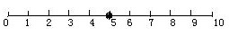

# Day 2
* * *
##  Course -- `DP`

 

* * *
## Problem--`SUSTechCPC 寒假集训day2`

 

[
 B. E. Segment Sum  
](https://codeforces.com/problemset/problem/1073/E)
---

 time limit per test: 1.0 s 

 memory limit per test: 256 MB 

 

You are given two integers l and r (l≤r). Your task is to calculate the sum of numbers from l to r (including l and r) such that each number contains at most k different digits, and print this sum modulo 998244353.

For example, if k=1 then you have to calculate all numbers from l to r such that each number is formed using only one digit. For l=10,r=50 the answer is 11+22+33+44=110.

**Input**

The only line of the input contains three integers l, r and k $(1≤l≤r<10^{18},1≤k≤10)$ — the borders of the segment and the maximum number of different digits.

**Output**

Print one integer — the sum of numbers from l to r such that each number contains at most k different digits, modulo 998244353.

**Example**

> **Input**
> 10 50 2

> **Output**
> 1230

* * *

> **Input**
> 1 2345 10

> **Output**
> 2750685

* * *

> **Input**
> 101 154 2

> **Output**
> 2189

 

**思路：**
> 题意是给定一个数字区间，找该区间内的一类数字特征为“不同数字个数不超过k种”的数字的总和（不是总个数），结果mod 998244353。
> 通过输入数值的范围$(1≤l≤r<10^{18},1≤k≤10)$，我们知道就算是On也会T，所以是一道数位DP的题目，不过和平常题目不同，它要求统计所有数字的总和而不是总个数，所以要记一下每一位的贡献。
> 我们需要一个solve(x)函数返回(0,x)的答案，最后只用(solve(r) - solve(l - 1) + mod) % mod就可以了。
> a[]存储着数字的每一位，注意前导零的判断和最高位数字的最大值。
> 本题开一个二维dp数组也行，两个二维dp数组也行。
> 其中有一个状压的操作，把每个数字是否出现用一个二进制数表示。
> 说实在的，感觉数位DP我还没有理解透彻，实现起来蛮困难的。

**二进制的基本操作**

[[C++实现代码传送门]](https://github.com/SUSTech-Neko/SUSTech-CPC/blob/master/2018Winter/day2-dp/B.cpp)

<br\>

[
 C. Milking Time 
](http://poj.org/problem?id=3616)
---

 time limit per test: 1000 ms 

 memory limit per test: 65536 K 

 

Bessie is such a hard-working cow. In fact, she is so focused on maximizing her productivity that she decides to schedule her next N (1 ≤ N ≤ 1,000,000) hours (conveniently labeled 0..N-1) so that she produces as much milk as possible.

Farmer John has a list of M (1 ≤ M ≤ 1,000) possibly overlapping intervals in which he is available for milking. Each interval i has a starting hour (0 ≤ starting_houri ≤ N), an ending hour (starting_houri < ending_houri ≤ N), and a corresponding efficiency (1 ≤ efficiencyi ≤ 1,000,000) which indicates how many gallons of milk that he can get out of Bessie in that interval. Farmer John starts and stops milking at the beginning of the starting hour and ending hour, respectively. When being milked, Bessie must be milked through an entire interval.

Even Bessie has her limitations, though. After being milked during any interval, she must rest R (1 ≤ R ≤ N) hours before she can start milking again. Given Farmer Johns list of intervals, determine the maximum amount of milk that Bessie can produce in the N hours.

**Input**

* Line 1: Three space-separated integers: N, M, and R
* Lines 2..M+1: Line i+1 describes FJ's ith milking interval withthree space-separated integers: starting_houri , ending_houri , and efficiencyi

**Output**

* Line 1: The maximum number of gallons of milk that Bessie can product in the N hours

**Example**

> **Input**
> 12 4 2
> 1 2 8
> 10 12 19
> 3 6 24
> 7 10 31

> **Output**
> 43

 

**思路：**
> 题意是给个时间长度n，m个工作时间段和每个时间段能完成的工作量，一次只能做一个工作并且一旦开始做就要把它做完，要求选择的两个工作时间段之间至少相差r时间（休息）求选择那些工作n时间内能完成的最大工作量。输出最大值。
> 是个简单的dp题，为了简化，把休息的时间r加到结束时间后，延长结束时间。之后先对M段时间根据开始时间由小到大排序，在一个二重循环中，根据dp[i] = max (dp[i], dp[j] + A[i].efficitive)更新dp数组。

[[C++实现代码传送门]](https://github.com/SUSTech-Neko/SUSTech-CPC/blob/master/2018Winter/day2-dp/C.cpp)

 

[
 D. 免费馅饼 
](http://acm.hdu.edu.cn/showproblem.php?pid=1176)
---

 time limit per test: 1000 ms 

 memory limit per test: 32768 K 

 

都说天上不会掉馅饼，但有一天gameboy正走在回家的小径上，忽然天上掉下大把大把的馅饼。说来gameboy的人品实在是太好了，这馅饼别处都不掉，就掉落在他身旁的10米范围内。馅饼如果掉在了地上当然就不能吃了，所以gameboy马上卸下身上的背包去接。但由于小径两侧都不能站人，所以他只能在小径上接。由于gameboy平时老呆在房间里玩游戏，虽然在游戏中是个身手敏捷的高手，但在现实中运动神经特别迟钝，每秒种只有在移动不超过一米的范围内接住坠落的馅饼。现在给这条小径如图标上坐标：

为了使问题简化，假设在接下来的一段时间里，馅饼都掉落在0-10这11个位置。开始时gameboy站在5这个位置，因此在第一秒，他只能接到4,5,6这三个位置中其中一个位置上的馅饼。问gameboy最多可能接到多少个馅饼？（假设他的背包可以容纳无穷多个馅饼）

**Input**

输入数据有多组。每组数据的第一行为以正整数$n(0<n<100000)$，表示有n个馅饼掉在这条小径上。在结下来的n行中，每行有两个整数$x,T(0<T<100000)$,表示在第T秒有一个馅饼掉在x点上。同一秒钟在同一点上可能掉下多个馅饼。n=0时输入结束。

**Output**

每一组输入数据对应一行输出。输出一个整数m，表示gameboy最多可能接到m个馅饼。
提示：本题的输入数据量比较大，建议用scanf读入，用cin可能会超时。

**Example**

> **Input**
> 6
> 5 1
> 4 1
> 6 1
> 7 2
> 7 2
> 8 3
> 0

> **Output**
> 4

 

**思路：**
> 题意是gameboy每一秒只能移动一格，求他最多能接住多少张馅饼
> 对于gameboy来说，他有两个参数，一个是当前位置，另一个是时间。他下一秒只能在0~10这十一个位置移动，而对于1~9这九个位置来说他可以移动（假设他现在的位置为x）到x+1，或者x-1，或者x；0和10这两个位置只有两个位置可以移动，可以用dp[t][x]，t秒的馅饼获得就看t-1秒时的下一位置（x+1，x，x-1）。因为要求整个过程的最大值，因此求的是dp累加的和，所以状态转移方程式为  $dp[i][j]+=max(dp[i+1][j1],max(dp[i+1][j],dp[i+1][j+1]))$

[[C++实现代码传送门]](https://github.com/SUSTech-Neko/SUSTech-CPC/blob/master/2018Winter/day2-dp/D.cpp)

 

[
 F. Bomb 
](http://acm.hdu.edu.cn/showproblem.php?pid=3555)
---

 time limit per test: 1000 ms 

 memory limit per test: 65536 K 

 

The counter-terrorists found a time bomb in the dust. But this time the terrorists improve on the time bomb. The number sequence of the time bomb counts from 1 to N. If the current number sequence includes the sub-sequence "49", the power of the blast would add one point.
Now the counter-terrorist knows the number N. They want to know the final points of the power. Can you help them?

**Input**

The first line of input consists of an integer T (1 <= T <= 10000), indicating the number of test cases. For each test case, there will be an integer N (1 <= N <= 2^63-1) as the description.

The input terminates by end of file marker.

**Output**

For each test case, output an integer indicating the final points of the power.

**Example**

> **Input**
> 3
> 1
> 50
> 500

> **Output**
> 0
> 1
> 15

 

**思路：**
> “不要62的”的原题，只是把62改成了49。简单的数位dp题，模板一般是一个dfs，一个solve和一个main方法。solve记录从0-x的结果；dfs进行状态方程，此类题目需要一个pre变量，记录前一个数字是不是4且下一位数字是不是9。

[[C++实现代码传送门]](https://github.com/SUSTech-Neko/SUSTech-CPC/blob/master/2018Winter/day2-dp/F.cpp)

 
