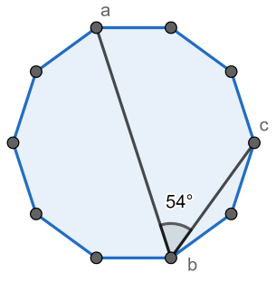

# Day 3
* * *
##  Course -- `netflow`

 

* * *
## Problem--`SUSTechCPC 寒假集训day3`

 

[
 A. [NOI2006]最大获利  
](https://www.lydsy.com/JudgeOnline/problem.php?id=1497)
---

 time limit per test: 5.0 s 

 memory limit per test: 64 MB 

 

新的技术正冲击着手机通讯市场，对于各大运营商来说，这既是机遇，更是挑战。THU集团旗下的CS&T通讯公司在新一代通讯技术血战的前夜，需要做太多的准备工作，仅就站址选择一项，就需要完成前期市场研究、站址勘测、最优化等项目。在前期市场调查和站址勘测之后，公司得到了一共N个可以作为通讯信号中转站的地址，而由于这些地址的地理位置差异，在不同的地方建造通讯中转站需要投入的成本也是不一样的，所幸在前期调查之后这些都是已知数据：建立第i个通讯中转站需要的成本为Pi（1≤i≤N）。另外公司调查得出了所有期望中的用户群，一共M个。关于第i个用户群的信息概括为Ai, Bi和Ci：这些用户会使用中转站Ai和中转站Bi进行通讯，公司可以获益Ci。（1≤i≤M, 1≤Ai, Bi≤N） THU集团的CS&T公司可以有选择的建立一些中转站（投入成本），为一些用户提供服务并获得收益（获益之和）。那么如何选择最终建立的中转站才能让公司的净获利最大呢？（净获利 = 获益之和 - 投入成本之和）

**Input**

输入文件中第一行有两个正整数N和M 。第二行中有N个整数描述每一个通讯中转站的建立成本，依次为P1, P2, …, PN 。以下M行，第(i + 2)行的三个数Ai, Bi和Ci描述第i个用户群的信息。所有变量的含义可以参见题目描述。

**Output**

你的程序只要向输出文件输出一个整数，表示公司可以得到的最大净获利。

**Example**

> **Input**
> 5 5
> 1 2 3 4 5
> 1 2 3
> 2 3 4
> 1 3 3
> 1 4 2
> 4 5 3

> **Output**
> 4

 

**思路：**
> 题意是
> 做法：跑最大权闭合图，用dinic算法建图，建一个源点S，先连向n个站点，边权为费用，m个客户连向汇点T，权值为利润，其他边之间流量为INF，跑出最大流 即为不选择建造的站点和不选用户，而损失的利益用总利益减去就好了。
> Dinic算法引入了一个叫做分层图的概念。具体就是对于每一个点，我们根据从源点开始的bfs序列，为每一个点分配一个深度，然后我们进行若干遍dfs寻找增广路，每一次由u推出v必须保证v的深度必须是u的深度+1。
> Dinic算法需要知道增广路这个定义。增广路定理(Augmenting Path Theorem): 网络达到最大流当且仅当残留网络中没有增广路
> 在Dinic算法中，我们加边的时候需要同时加上反向边。我们知道，当我们在寻找增广路的时候，在前面找出的不一定是最优解，如果我们在减去残量网络中正向边的同时将相对应的反向边加上对应的值，我们就相当于可以反悔从这条边流过。
> 我们已经想明白了为什么要加反向边，但反向边如何具体实现呢？笔者在学习网络流的时候在这里困扰了好久，现在简要的总结在这里。
> 首先讲一下邻接矩阵的做法，对于G[u][v]，如果我们要对其反向边进行处理，直接修改G[v][u]即可。
> 但有时会出现u->v和v->u同时本来就有边的情况，一种方法是加入一个新点p，使u->v，而v->u变成v->p,p->u。
> 另一种方法就是使用邻接表，我们把边从0开始编号，每加入一条原图中的边u->v时，加入边v->u流量设为0，那么这时对于编号为i的边u->v，我们就可以知道i^1就是其反向边v->u。

[[C++实现代码传送门]](https://github.com/SUSTech-Neko/SUSTech-CPC/blob/master/2018Winter/day3-network_flow/A.cpp)

 

[
 B. F. Make It Connected  
](https://codeforces.com/problemset/problem/1095/F)
---

 time limit per test: 2.0 s 

 memory limit per test: 256 MB 

 

You are given an undirected graph consisting of n vertices. A number is written on each vertex; the number on vertex i is ai. Initially there are no edges in the graph.

You may add some edges to this graph, but you have to pay for them. The cost of adding an edge between vertices x and y is ax+ay coins. There are also m special offers, each of them is denoted by three numbers x, y and w, and means that you can add an edge connecting vertices x and y and pay w coins for it. You don't have to use special offers: if there is a pair of vertices x and y that has a special offer associated with it, you still may connect these two vertices paying ax+ay coins for it.

What is the minimum number of coins you have to spend to make the graph connected? Recall that a graph is connected if it's possible to get from any vertex to any other vertex using only the edges belonging to this graph.

**Input**

The first line contains two integers n and m (1≤n≤2⋅105, 0≤m≤2⋅105) — the number of vertices in the graph and the number of special offers, respectively.

The second line contains n integers a1,a2,…,an (1≤ai≤1012) — the numbers written on the vertices.

Then m lines follow, each containing three integers x, y and w (1≤x,y≤n, 1≤w≤1012, x≠y) denoting a special offer: you may add an edge connecting vertex x and vertex y, and this edge will cost w coins.

**Output**

Print one integer — the minimum number of coins you have to pay to make the graph connected.

**Example**

> **Input**
> 3 2
> 1 3 3
> 2 3 5
> 2 1 1

> **Output**
> 5

* * *

> **Input**
> 4 0
> 1 3 3 7

> **Output**
> 16

* * *

> **Input**
> 5 4
> 1 2 3 4 5
> 1 2 8
> 1 3 10
> 1 4 7
> 1 5 15

> **Output**
> 18

 

**思路：**
> 题意是把若干个点用最小的代价联通，每条边的代价是两个点的数字和或者有特例的代价。
> 做法：在没有特例的情况下，一定是每个点和最小的那个点连接起来代价最小。如果在有特例的情况，且特例的代价小于两点和，那么可以取特例。
> 类似最小生成树，需要用到并查集，判断某点是否已被连接。

[[C++实现代码传送门]](https://github.com/SUSTech-Neko/SUSTech-CPC/blob/master/2018Winter/day3-network_flow/B.cpp)

 

[
 C. Posterized  
](https://codeforces.com/problemset/problem/980/C)
---

 time limit per test: 1.0 s 

 memory limit per test: 256 MB 

 

Professor Ibrahim has prepared the final homework for his algorithm’s class. He asked his students to implement the Posterization Image Filter.

Their algorithm will be tested on an array of integers, where the i-th integer represents the color of the i-th pixel in the image. The image is in black and white, therefore the color of each pixel will be an integer between 0 and 255 (inclusive).

To implement the filter, students are required to divide the black and white color range [0, 255] into groups of consecutive colors, and select one color in each group to be the group’s key. In order to preserve image details, the size of a group must not be greater than k, and each color should belong to exactly one group.

Finally, the students will replace the color of each pixel in the array with that color’s assigned group key.

To better understand the effect, here is an image of a basking turtle where the Posterization Filter was applied with increasing k to the right.

To make the process of checking the final answer easier, Professor Ibrahim wants students to divide the groups and assign the keys in a way that produces the lexicographically smallest possible array.

**Input**

The first line of input contains two integers n and k (1≤n≤105, 1≤k≤256), the number of pixels in the image, and the maximum size of a group, respectively.

The second line contains n integers p1,p2,…,pn (0≤pi≤255), where pi is the color of the i-th pixel.

**Output**

The first line of input contains two integers n and k (1≤n≤105, 1≤k≤256), the number of pixels in the image, and the maximum size of a group, respectively.

The second line contains n integers p1,p2,…,pn (0≤pi≤255), where pi is the color of the i-th pixel.

**Example**

> **Input**
> 4 3
> 2 14 3 4

> **Output**
> 0 12 3 3

* * *

> **Input**
> 5 2
> 0 2 1 255 254

> **Output**
> 0 1 1 254 254

 

**思路：**
> 题意是给出n个数字，每个数字都在[0,255]中，将这些数分组，每组长度不能超过k。每个组不能有重复区间，组内得元素用改组得key代表，输出n个数字使得字典序最小。
> 做法：初始化数组为-1，每次加一个数字，在它前面找k个数字，看有没有被标记过的，有的话这个数字就是被标记的那个数字的组里，没有的话，给这个数字的位置打标记。如此贪心做就可以了。

[[C++实现代码传送门]](https://github.com/SUSTech-Neko/SUSTech-CPC/blob/master/2018Winter/day3-network_flow/C.cpp)

 

[
 E. [SHOI2008]小约翰的游戏John  
](https://www.lydsy.com/JudgeOnline/problem.php?id=1022)
---

 time limit per test: 1.0 s 

 memory limit per test: 162 MB 

 

小约翰经常和他的哥哥玩一个非常有趣的游戏：桌子上有n堆石子，小约翰和他的哥哥轮流取石子，每个人取的时候，可以随意选择一堆石子，在这堆石子中取走任意多的石子，但不能一粒石子也不取，我们规定取到最后一粒石子的人算输。小约翰相当固执，他坚持认为先取的人有很大的优势，所以他总是先取石子，而他的哥哥就聪明多了，他从来没有在游戏中犯过错误。小约翰一怒之前请你来做他的参谋。自然，你应该先写一个程序，预测一下
谁将获得游戏的胜利。

**Input**

本题的输入由多组数据组成第一行包括一个整数T，表示输入总共有T组数据（T≤500）。每组数据的第一行包
括一个整数N（N≤50），表示共有N堆石子，接下来有N个不超过5000的整数，分别表示每堆石子的数目。

**Output**

每组数据的输出占一行，每行输出一个单词。如果约翰能赢得比赛，则输出“John”，否则输出“Brother”，请注意单词的大小写。

**Example**

> **Input**
> 2
> 3
> 3 5 1
> 1
> 1

> **Output**
> John
> Brother

 

**思路：**
> 经典的反尼姆博弈的题目，即取到最后的一个人输。
> 考虑两种情况：
> 如果所有的堆都是1，那么堆数为偶先手必胜，否则先手必败
> 若Xor!=0，那么先手可以先拿走一部分让Xor=0，然后同状态2先手必胜，否则先手必败。
> 任何奇异局势（a，b，c）都有a（+）b（+）c =0。如果我们面对的是一个非奇异局势（a，b，c），要如何变为奇异局势呢？假设 a < b< c,我们只要将 c 变为 a（+）b,即可,因为有如下的运算结果: a（+）b（+）(a（+）b)=(a（+）a)（+）(b（+）b)=0（+）0=0。要将c 变为a（+）b，只要从 c中减去 c-（a（+）b）即可。

[[C++实现代码传送门]](https://github.com/SUSTech-Neko/SUSTech-CPC/blob/master/2018Winter/day3-network_flow/E.cpp)

 

[
  F. C. Yuhao and a Parenthesis  
](https://codeforces.com/problemset/problem/1097/C)
---

 time limit per test: 2.0 s 

 memory limit per test: 256 MB 

 

One day, Yuhao came across a problem about checking if some bracket sequences are correct bracket sequences.

A bracket sequence is any non-empty sequence of opening and closing parentheses. A bracket sequence is called a correct bracket sequence if it's possible to obtain a correct arithmetic expression by inserting characters "+" and "1" into this sequence. For example, the sequences "(())()", "()" and "(()(()))" are correct, while the bracket sequences ")(", "(()" and "(()))(" are not correct.

Yuhao found this problem too simple for him so he decided to make the problem harder. You are given many (not necessarily correct) bracket sequences. The task is to connect some of them into ordered pairs so that each bracket sequence occurs in at most one pair and the concatenation of the bracket sequences in each pair is a correct bracket sequence. The goal is to create as many pairs as possible.

This problem unfortunately turned out to be too difficult for Yuhao. Can you help him and solve it?

**Input**

The first line contains one integer n (1≤n≤105) — the number of bracket sequences.

Each of the following n lines contains one bracket sequence — a non-empty string which consists only of characters "(" and ")".

The sum of lengths of all bracket sequences in the input is at most 5⋅105.

Note that a bracket sequence may appear in the input multiple times. In this case, you can use each copy of the sequence separately. Also note that the order in which strings appear in the input doesn't matter.

**Output**

Print a single integer — the maximum number of pairs which can be made, adhering to the conditions in the statement.

**Example**

> **Input**
> 7
> )())
> )
> ((
> ((
> (
> )
> )

> **Output**
> 2

* * *

> **Input**
> 4
> (
> ((
> (((
> (())

> **Output**
> 0

* * *

> **Input**
> 2
> (())
> ()

> **Output**
> 1

 

**思路：**
> 题意是让你把一堆括号串配对，看最多能配成多少对左右括号相等的括号。
> 用一个数组存一下左括号多1，2，3……，右括号多1，2，3……的各有多少个，对应配对即可。

[[C++实现代码传送门]](https://github.com/SUSTech-Neko/SUSTech-CPC/blob/master/2018Winter/day3-network_flow/F.cpp)

 

[
  G. C. Polygon for the Angle  
](https://codeforces.com/problemset/problem/1096/C)
---

 time limit per test: 2.0 s 

 memory limit per test: 256 MB 

 

You are given an angle ang.

The Jury asks You to find such regular n-gon (regular polygon with n vertices) that it has three vertices a, b and c (they can be non-consecutive) with ∠abc=ang or report that there is no such n-gon.

If there are several answers, print the minimal one. It is guarantied that if answer exists then it doesn't exceed 998244353.

**Input**

The first line contains single integer T (1≤T≤180) — the number of queries.

Each of the next T lines contains one integer ang (1≤ang<180) — the angle measured in degrees.

**Output**

For each query print single integer n (3≤n≤998244353) — minimal possible number of vertices in the regular n-gon or −1 if there is no such n.

**Example**

> **Input**
> 4
> 54
> 50
> 2
> 178

> **Output**
> 10
> 18
> 90
> 180

 

**思路：**
> 题意是给你一个多边形，取任意三个点构成的一个角的度数，返回这个多边形的边数的最小值。
> 可以做一个外接圆，那么这个角就是圆周角。
> 做法一：发现每个给的的角度是整数，直接打表。每个数值怎么算见做法二。
> 做法二：
> $\frac{k}{n} × 180 = θ$
> 移项得
> $k × 180 = θ × n$
> $s = gcd(θ , 180)$
> $\frac{180}{s} × k = \frac{θ}{s} × n$
> $k = \frac{θ}{s} , n = \frac{180}{s}$
> 考虑 k ≤ n − 2,不断加 n 直到合法。

[[C++实现代码传送门]](https://github.com/SUSTech-Neko/SUSTech-CPC/blob/master/2018Winter/day3-network_flow/G.cpp)
